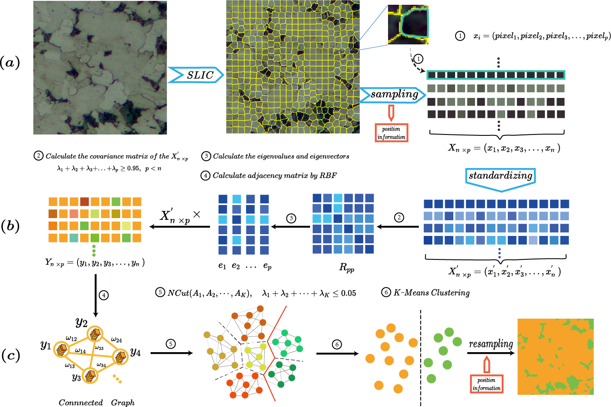
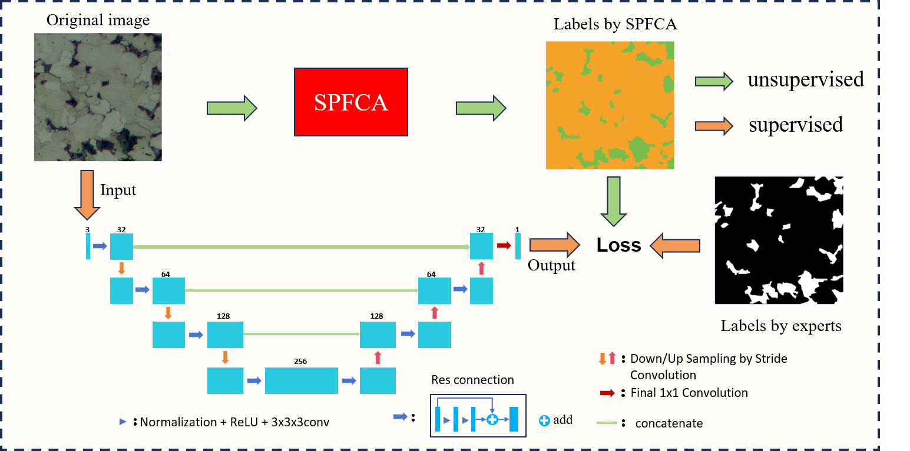

## 1. 项目描述
- 通过Pytorch,opencv,skimage,sklearn等库，实现了[Superpixel-based principal feature clustering annotation method for dual-phase microstructure segmentation](https://doi.org/10.1016/j.matchar.2024.114523)

## 2. 代码结构
```SPFCA_code_and_validation
|--dataset
|   |--dataset.py：数据集操作
|   |--utils.py：数据处理配置文件
|--nets
|   |--fcn.py：FCN网络
|   |--unet.py：UNet网络
|   |--resunet.py：ResUNet网络
|--utils
|   |--loss_utils.py：损失函数
|   |--train_utils.py：训练函数
|--datasets: 数据集文件夹
|--image_results: 预测可视化结果文件夹
|--static_results: 统计结果文件夹
|--train.py：训练脚本
|--statistical_prediction.py：预测并计算统计结果
|--visual_prediction：预测并可视化结果
|--spfca.py: Superpixel-based pricipal feature clustering annotation method
|--draw_heatmap.py：绘制热力图
|--README.md：说明文档
```

## 3. 验证数据集说明
```
    - datasets文件夹下存放了四个验证数据集，包括：
    - dataset1：包含15张与训练数据同一批次采集的图片，用于测试single数据集内模型的性能
    - dataset2：包含15张与dataset1相同成像参数，但设备不同时采集的图片，用于测试仪器设备对模型性能的影响
    - dataset3：包含15张与dataset1相同成像参数，设备不同，图片聚焦更差时采集的图片，用于测试图片清晰度对模型性能的影响
    - dataset4：包含15张与dataset1相同成像参数，设备不同，样本受到一定污染时采集的图片，用于测试样本污染对模型性能的影响
```
## 4. 环境配置
**SPFCA_code_and_validation**
```
python==3.10
matplotlib==3.7.1
numpy==1.25.2
opencv-python==4.8.1.78
pandas==2.2.2
Pillow==9.3.0
scikit-image==0.21.0
scikit-learn==1.2.2
scipy==1.10.1
torch==2.0.1
```
**一键部署**
```
pip install -r requirements.txt
```

## 运行方式
**1. 训练模型**
```
python train.py --model_filename your_model_filename
```

将你的训练数据放到datasets/dataset1/train_images文件夹下，运行train.py脚本，指定模型名称，训练参数等。
```
such as: python train.py --model_filename '(30)semi-supervisedResUNet.h5'
```

**2. 预测并计算统计结果**
```
python statistical_prediction.py --model_filename your_model_filename
```
such as:
```
python statistical_prediction.py --model_filename '(30)semi-supervisedResUNet.h5'
```
结果保存至：static_results文件夹

**3. 预测并可视化结果：**
```
python visual_prediction.py --model_filename your_model_filename
```
such as:
```
python visual_prediction.py --model_filename '(30)semi-supervisedResUNet.h5'
```
结果保存至：image_results文件夹


## spfca自动标注算法


## 训练预测路径

